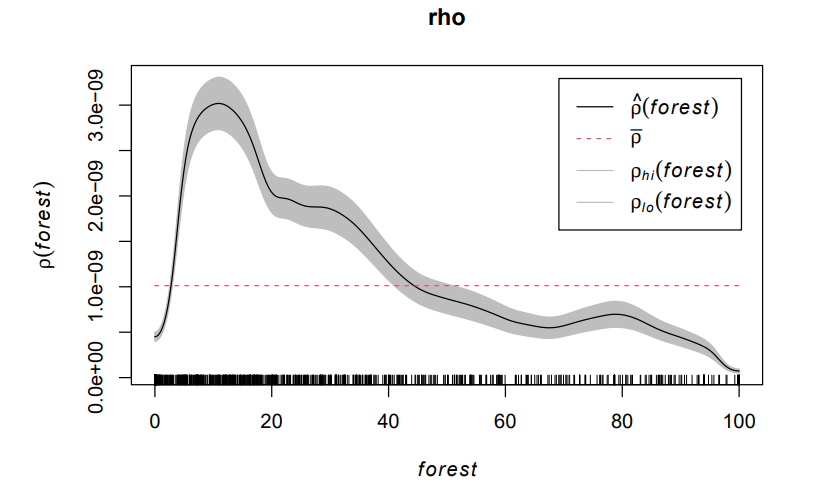
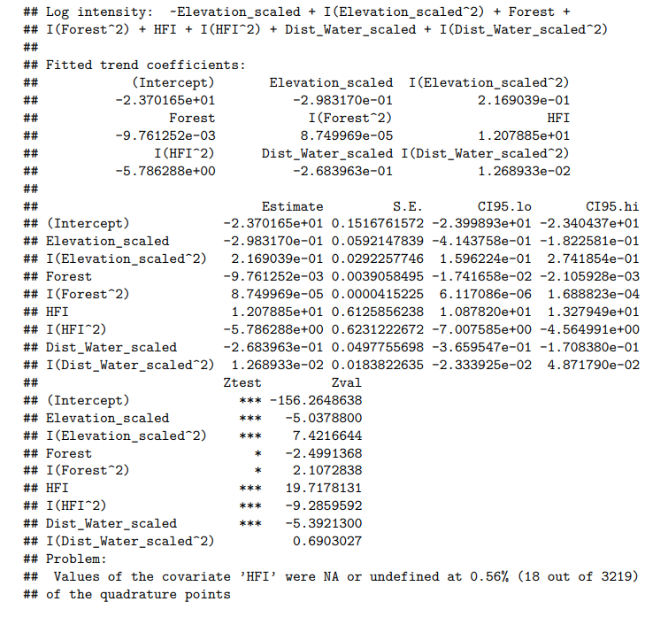

# Coyote Spatial Statistics 

## Overview
This project attempts to explore the spatial distribution of coyotes in British Columbia (BC), Canada,
and its potential interaction with environmental covariates. The scope of the study covers the entire province
of BC, which is known to have a significant population of coyotes. The project explores the relationship
between coyote populations and four environmental covariates within the province: elevation, forest cover,
distance to water, and human footprint index (HFI). Characteristics of the spatial distribution of coyote
occurrences and their potential relationships with these local environmental covariates are explored with
various spatial data analysis techniques. According to Furbeaer Management Guidelines published by BC
Government, the earliest occurrences of coyotes in BC were reported in the 1930s. In the recent decade, they
rapidly expanded within the province, including in urban areas. The current project attempts to further explore the distribution of
coyotes within BC and their potential relationships with the environmental covariates of interest to provide
insight into the management and conservation of coyotes in BC. Various spatial data analysis techniques
implemented by spatial data analysis packages in R are employed to investigate the relationships between the
coyote occurrence locations and how environmental covariates influence the spatial distribution of coyotes

## Intensity analysis
The density estimation of the intensity (lambda_hat) with default bandwidth selection (the brighter the color, the more coyotes) shows that the distribution of coyotes is inhomogeneous; more coyotes are living in the southern part of BC.

     
   
A Scan Likelihood Ratio Test is performed, identifying two hot spots where coyotes tend to cluster together, which seem to be Vancouver and Kelowna.  
   

## Interaction with environmental variables
The density estimates of coyote were plotted against different environmental covariates to examine if there are any relationship between the distribution of coyote and different environmental conditions.    
   
For example, the density estimates of coyote plotted against the Human Footprint Index (HFI) shows the coyotes tend to cluster in places with higher level of human activities. 

   
    
       
And they tend to concentrate in places with lower forest coverage and are less likely to appear in high forest coverage areas. (The dotted red lines represents what it should be if forest coverage had no influence on coyote distribution) 
   

## Second Moment Statistics
Ripley's K function provides a statistically reliable way to understand how coyotes are clustering.     
   
   
    
The graph shows that at some distances r (from 0 to 10km, and from 20km to 25km) the k function is above what it should be (the dotted red line) if the coyotes were randomly distributed. It suggests that coyotes are indeed clustering as they appear more frequently than they should be if they were random. But the clustering tendency varies at different scales of analysis, namely distances, which is likely influenced by the environmental covariates explored in the section above.

## Poisson Point Process Model
Now we can try to model the spatial distribution using Poisson Point Process model. The environmental covariates are scaled and checked for collinearity before fitting the model.

   
   
The model suggests that all the environmental covariates are significantly affecting the intensity of coyotes except for the quadratic term of "distance to water" (the quadratic terms are added to increase the model's flexibility so that it can capture the patterns in data better).    
    
The quadratic term for distance to water is thus removed, and a reduced model is fitted. The reduced model has a lower AIC, indicating that it is a better model that fits the data well and is not too complex.   
   
We now estimate the intensity of coyotes with our reduced model and overlay the actual coyote sightings.   
   
    
   
    
The brighter color indicates higher intensity of coyotes. It seems that the prediction is doing Okay as most of the dots (actual coyte sightings) are in the bright areas. But the model is not perfect, there are over-estimations in some areas.   

We can check the smoothed residual too access the model fit.    
   
    
    
Residuals closer to zero  indicate good model fit. The current model seems to be less accurate in the south, which is consistant with the over-estimations.
   

## Improving the model
The current the model might not be flexible enough. We can check this by looking at partial residuals   
   
   
   
The graph shows the partial residual for elevation. It seems that the model is not capturing the relationship between elevation and coyote intensity well.   
    
Remember that we only have a quadratic term for each environmental covariate. We could improve the model fit by adding more polynomial terms for the covariates.   
   
   
   
This is the partial residual of elevation when up to the 7th power polynomial term is included. The model captures the relationship much better than before.   
    
   
   

Now the residuals of the model are better than before (closer to zero).
   

